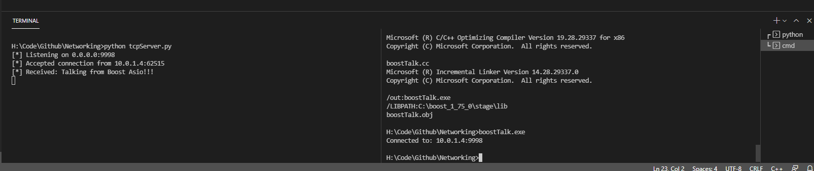
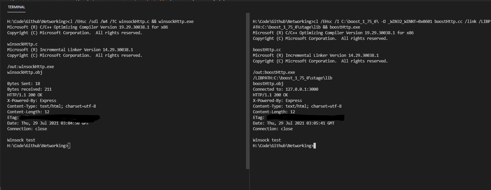

# Networking
## Networked computer programs & steps on compiling the Boost libraries on CLI.

### From a higher level Boost Asio/Beast can be utilized to create networked programs. I wrote steps to compile Boost on Windows 10 without Visual Studio.  VCPKG does not work with Visual Studio build tools, which is what I use.
# Compiling Boost:
    Complete the following where Boost was extracted to:
    0. Extract boost to a location of your choice
    1. launch an elevated command prompt or powershell(It is not in the documentation it may be an unnecessary step)
    2. cd [boosts location]
    3. bootstrap
    4. b2
    5. b2 runtime-link=static (I had to compile with the link. Asio and Regex were mising static dependencies(libs). The following may be redundant. I do not know if the fourth statement is necessary(I compiled multiple times)
# Output:
## The Boost C++ Libraries were successfully built!
### Note I chose the following directories
## The following directory should be added to compiler include paths:

    C:\boost_1_75_0

## The following directory should be added to linker library paths:

    C:\boost_1_75_0\stage\lib

# Compile Commands 
    Multi line:
            cl /EHsc /I C:\boost_1_75_0\ client.cpp /link ^ /LIBPATH:C:\boost_1_75_0\stage\lib

    Single line:
    cl /EHsc /I C:\boost_1_75_0\ client.cpp /link LIBPATH:C:\boost_1_75_0\stage\lib

    Asio: cl /EHsc -D_WIN32_WINNT=0x0601 /I C:\boost_1_75_0\ client.cpp /link ^ /LIBPATH:C:\boost_1_75_0\stage\lib

# Example of the python tcp server and Boost Asio interacting.

# Example of winsock HTTP & Boost HTTP

